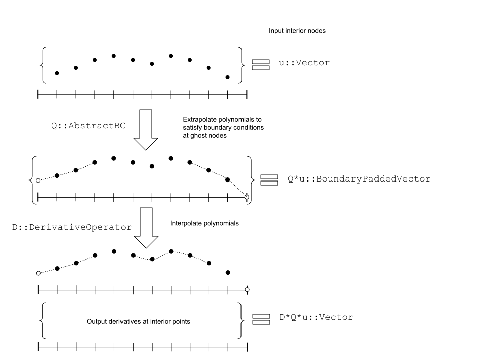

# DiffEqOperators.jl

[](https://travis-ci.org/JuliaDiffEq/DiffEqOperators.jl)
[](https://ci.appveyor.com/project/ChrisRackauckas/diffeqoperators-jl)
[](https://gitlab.com/juliadiffeq/DiffEqOperators-jl/pipelines)
[](https://coveralls.io/github/JuliaDiffEq/DiffEqOperators.jl?branch=master)
[](http://codecov.io/github/JuliaDiffEq/DiffEqOperators.jl?branch=master)

Construct finite-difference operators to discretize a partial
differential equation and its boundary conditions by the method of
lines.  This reduces it to a system of ordinary differential
equations that can be solved by [`DifferentialEquations.jl`](https://juliadiffeq.org/).

Both centered and [upwind](https://en.wikipedia.org/wiki/Upwind_scheme)
operators are provided, for domains of any dimension, arbitrarily
spaced grids, and for any order of accuracy.  The cases of 1, 2 and
3 dimensions with an evenly spaced grid are optimized with a
convolution routine from `NNlib.jl`.  Care is taken to avoid
unnecessary allocations.

Any operator can be concretised as an `Array`, a `BandedMatrix` or
a sparse matrix.

## The simplest case

As shown in the figure, the operators act on a set of samples
`f_j = f(x_j)` for a function `f` at a grid of points `x_j`.  The
grid has `n` interior points at `x_j = jh` for `j = 1` to `n`, and 2
boundary points at `x_0 = 0` and `x_{n+1} = (n+1) h`.  The input to
the numerical operators is a vector `u = [f_1, f_2, …, f_N]`, and
they output a vector of sampled derivatives `du ≈ [f'(x_1), f'(x_2),
…, f'(x_N)]`, or a higher order derivative as requested.

A numerical derivative operator `D` of order `m` can be constructed
for this grid with `D = CenteredDifference(1, m, h, n)`  The argument
`1` indicates that this is a first derivative.  Order `m` means
that the operator is exact up to rounding when `f` is a polynomial
of degree `m` or lower.

The derivative operator `D` is used along with a boundary condition
operator `Q`, to compute derivatives at the interior points of the
grid.  A simple boundary condition `f(x_0) = f(x_n+1) = 0` is
constructed with `Q = Dirichlet0BC(eltype(u))`.

Given these definitions, the derivatives are calculated as if the
operators `D` and `Q` were matrices.  `du = D*Q*u`.  This is an
abuse of notation!  The particular `Q` in this example is a linear
operator, but in general boundary conditions are affine operators.
They have the form `Q(x) = M*x + c`, where `M` is a matrix and `c`
is a constant vector.  As a consequence, `Q` can not be concretized
to a matrix.



The operator `D` works by interpolating a polynomial of degree `m`
through `m+1` adjacent points on the grid.  Near the middle of the
grid, the derivative is approximated at `x_j` by interpolating a
polynomial of order `m` with `x_j` at its centre.  To define a
order-`m` polynomial, values are required at `m+1` points.  When
`x_j` is too close to the boundary for that to fit, the polynomial
is interpolated through the leftmost or rightmost `m+1` points,
including two “ghost” points that `Q` appends on the boundaries.
The numerical derivatives are linear combinations of the values
through which the polynomials are interpolated.  The vectors of
coefficients in these linear combinations are called “stencils”.
Because `D` takes values at the ghost points and returns values at
the interior points, it is a `n×(n+2)` matrix.

The boundary condition operator `Q`
acts as an `(n+2)×n` matrix.  The output `Q*u` is a vector of values
on the `n` interior and the 2 boundary points, `[a, f(x_1), …, f(x_N), b]`.
The interior points take the values of `u`.  The values `a` and `b` are
samples at “ghost” points on the grid boundaries.  As shown, these
values are assigned so that an interpolated polynomial `P(x)` satisfies
the left hand boundary condition, and `Q(x)` satisfies the right hand
boundary condition.  The boundary conditions provided by the
library are precisely those for which the values `a` and `b` are affine
functions of the interior values `f_j`, so that `Q` is an affine operator.

## Higher dimensions

In one dimension, `u` is naturally stored as a `Vector`,
and the derivative and boundary condition operators are similar
to matrices.

In two dimensions, the values `f(x_j)` are naturally stored as a
matrix.  Taking derivatives along the downwards axis is easy, because
matrices act columnwise.  Horizontal derivatives can be taken by
transposing the matrices.  The derivative along the rightward axis
is `(D*F')' = F*D' `.  This is easy to code, but less easy to read
for those who haven't seen it before.

When a function has three or more arguments, its values are naturally
stored in a higher dimensional array.  Julia's multiplication
operator is only defined for `Vector` and `Matrix`, so applying an
operator matrix to these arrays would require a complicated and
error prone series of `reshape` and axis permutation functions.

Therefore the types of derivative and boundary condition operators
are parameterised by the axis along which the operator acts.  With
derivative operators, the axis is supplied as a type parameter.
The simple case `CenteredDifference(…)` is equivalent to
`CenteredDifference{1}(…)`, row-wise derivatives are taken by
`CenteredDifference{2}(…)`, sheet-wise by `CenteredDifference{3}(…)`,
and along the `N`th axis by `CenteredDifference{N}(…)`.

Boundary conditions are more complicated.  See `@doc MultiDimBC`
for how they are supposed to work in multiple dimensions.  They
don't currently work that way.

## Constructors

The constructors are as follows:

```julia
CenteredDifference{N}(derivative_order::Int,
                      approximation_order::Int, dx,
                      len::Int, coeff_func=nothing)

UpwindDifference{N}(derivative_order::Int,
                    approximation_order::Int, dx
                    len::Int, coeff_func=nothing)
```

The arguments are:

- `N`: The directional dimension of the discretization. If `N` is not given,
  it is assumed to be 1, i.e. differencing occurs along columns.
- `derivative_order`: the order of the derivative to discretize.
- `approximation_order`: the order of the discretization in terms of O(dx^order).
- `dx`: the spacing of the discretization. If `dx` is a `Number`, the operator
  is a uniform discretization. If `dx` is an array, then the operator is a
  non-uniform discretization.
- `len`: the length of the discretization in the direction of the operator.
- `coeff_func`: An operational argument for a coefficient function `f(du,u,p,t)`
  which sets the coefficients of the operator. If `coeff_func` is a `Number`
  then the coefficients are set to be constant with that number. If `coeff_func`
  is an `AbstractArray` with length matching `len`, then the coefficients are
  constant but spatially dependent.

`N`-dimensional derivative operators need to act against a value of at least
`N` dimensions.

### Derivative Operator Actions

These operators are lazy, meaning the memory is not allocated. Similarly, the
operator actions `*` can be performed without ever building the operator
matrices. Additionally, `mul!(y,L,x)` can be performed for non-allocating
applications of the operator.

### Concretizations

The following concretizations are provided:

- `Array`
- `SparseMatrixCSC`
- `BandedMatrix`
- `BlockBandedMatrix`

Additionally, the function `sparse` is overloaded to give the most efficient
matrix type for a given operator. For one-dimensional derivatives this is a
`BandedMatrix`, while for higher dimensional operators this is a `BlockBandedMatrix`.
The concretizations are made to act on `vec(u)`.

A contraction operator concretizes to an ordinary matrix, no matter which dimension 
the contraction acts along, by doing the kroncker product formulation. I.e., the
action of the built matrix will match the action on `vec(u)`.

## Boundary Condition Operators

Boundary conditions are implemented through a ghost node approach. The discretized
values `u` should be the interior of the domain so that, for the boundary value
operator `Q`, `Q*u` is the discretization on the closure of the domain. By
using it like this, `L*Q*u` is the `NxN` operator which satisfies the boundary
conditions.

### Periodic Boundary Conditions

The constructor `PeriodicBC` provides the periodic boundary condition operator.

### Robin Boundary Conditions

The variables in l are `[αl, βl, γl]`, and correspond to a BC of the form
`al*u(0) + bl*u'(0) = cl`, and similarly `r` for the right boundary
`ar*u(N) + br*u'(N) = cl`.

```julia
RobinBC(l::AbstractArray{T}, r::AbstractArray{T}, dx::AbstractArray{T}, order = one(T))
```

Additionally, the following helpers exist for the Neumann `u'(0) = α` and
Dirichlet `u(0) = α` cases.

```julia
DirichletBC(αl::T, αr::T)
Dirichlet0BC(T::Type) = DirichletBC(zero(T), zero(T))
```

This fixes `u = αl` at the first point of the grid, and `u = αr` at the last point.

```julia
Neumann0BC(dx::Union{AbstractVector{T}, T}, order = 1)
NeumannBC(α::AbstractVector{T}, dx::AbstractVector{T}, order = 1)
```

### General Boundary Conditions

Implements a generalization of the Robin boundary condition, where α is a vector
of coefficients. Represents a condition of the form
α[1] + α[2]u[0] + α[3]u'[0] + α[4]u''[0]+... = 0

```julia
GeneralBC(αl::AbstractArray{T}, αr::AbstractArray{T}, dx::AbstractArray{T}, order = 1)
```


### Operator Actions

The boundary condition operators act lazily by appending the appropriate values
to the end of the array, building the ghost-point extended version for the
derivative operator to act on. This utilizes special array types to not require
copying the interior data.

### Concretizations

The following concretizations are provided:

- `Array`
- `SparseMatrixCSC`

Additionally, the function `sparse` is overloaded to give the most efficient
matrix type for a given operator. For these operators it's `SparseMatrixCSC`.
The concretizations are made to act on `vec(u)`.

## GhostDerivative Operators

When `L` is a `DerivativeOperator` and `Q` is a boundary condition operator,
`L*Q` produces a `GhostDerivative` operator which is the composition of the
two operations.

### Concretizations

The following concretizations are provided:

- `Array`
- `SparseMatrixCSC`
- `BandedMatrix`

Additionally, the function `sparse` is overloaded to give the most efficient
matrix type for a given operator. For these operators it's `BandedMatrix` unless
the boundary conditions are `PeriodicBC`, in which case it's `SparseMatrixCSC`.
The concretizations are made to act on `vec(u)`.

## Matrix-Free Operators

```julia
MatrixFreeOperator(f::F, args::N;
                   size=nothing, opnorm=true, ishermitian=false) where {F,N}
```

A `MatrixFreeOperator` is a linear operator `A*u` where the action of `A` is
explicitly defined by an in-place function `f(du, u, p, t)`.

## Jacobian-Vector Product Operators

```julia
JacVecOperator{T}(f,u::AbstractArray,p=nothing,t::Union{Nothing,Number}=nothing;autodiff=true,ishermitian=false,opnorm=true)
```

The `JacVecOperator` is a linear operator `J*v` where `J` acts like `df/du`
for some function `f(u,p,t)`. For in-place operations `mul!(w,J,v)`, `f`
is an in-place function `f(du,u,p,t)`.

## Operator Compositions

Multiplying two DiffEqOperators will build a `DiffEqOperatorComposition`, while
adding two DiffEqOperators will build a `DiffEqOperatorCombination`. Multiplying
a DiffEqOperator by a scalar will produce a `DiffEqScaledOperator`. All
will inherit the appropriate action.

### Efficiency of Composed Operator Actions

Composed operator actions utilize NNLib.jl in order to do cache-efficient
convolution operations in higher dimensional combinations.
